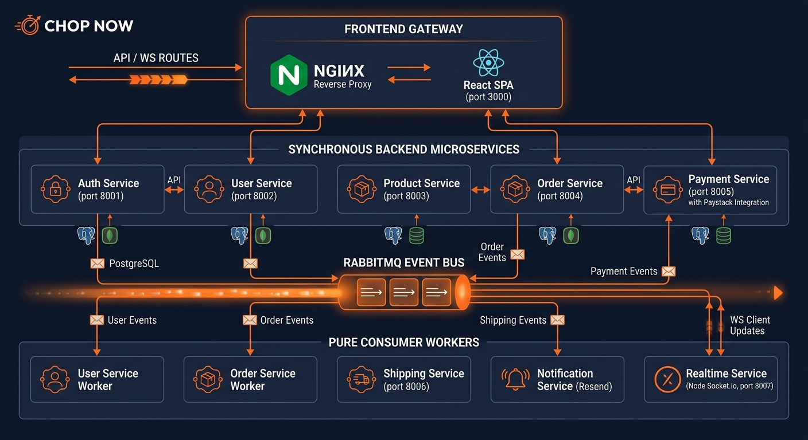

# Chop Now



A microservices-based food delivery platform for Nigerian cuisine, built with **FastAPI**, **PostgreSQL**, **RabbitMQ**, **Socket.io**, and a **React** frontend. Deployed live at [chopnownow.com](https://chopnownow.com).

Users can register, verify their email, and authenticate securely. A new registration triggers an asynchronous, event-driven workflow that creates a user profile in a separate service. Profiles can be read and updated through a JWT-protected API. A separate catalog service exposes a public, browsable menu — categories and products with size-based pricing and real food photos — while keeping all writes restricted to staff accounts. Users can add items to a persistent cart, check out with real-time price verification, and pay through Paystack's hosted checkout page — with webhook-driven order status updates flowing back through the system automatically. Once paid, a shipment is auto-created; staff dispatch it and notify the customer on delivery, who then confirms receipt or disputes it — with a 2-hour auto-confirmation cron as a safety net if the customer never responds. The order state machine advances automatically via RabbitMQ events at every step, customers receive transactional emails via Resend at each stage, and a dedicated real-time service pushes live order-status updates to the browser over WebSockets — no polling, no manual refresh. The entire flow is accessible through a React single-page application served by nginx, which proxies API calls to the appropriate backend service so the frontend never knows the system is split across nine separate services. No service touches another's database, and no service calls another's API except where synchronous communication is the correct architectural choice.

---

## Architecture

This project follows eleven complementary patterns:

**1. Database-per-service** — each microservice owns its own PostgreSQL database and is the only service allowed to read/write it directly.

**2. Event-driven communication** — services don't call each other's APIs synchronously to propagate side effects. Instead, a service publishes an event when something happens, and any number of other services can independently react to it, without the publisher knowing or caring who's listening.

**3. Shared-secret JWT verification across services** — `auth-service` issues JWTs; `user-service`, `product-service`, `order-service`, and `shipping-service` independently verify them using the same signing secret, without ever calling back into `auth-service`. Each service trusts the token's signature, not a network round-trip.

**4. Public reads, claim-gated writes** — `product-service`'s menu is openly browsable by anyone, but creating, updating, or deleting catalog data requires a JWT carrying `is_staff: true`. The same pattern applies to `shipping-service` — customers can track their own shipment, but only staff can dispatch or notify. Authentication (who you are) and authorization (what you're allowed to do) are enforced as two distinct, separately-tested checks.

**5. Synchronous service-to-service calls where correctness requires it** — checkout verifies live prices against `product-service` and initializes payment via `payment-service` synchronously. This is a deliberate exception to the event-driven default: a user sitting at the checkout screen needs an immediate answer, and a failed payment must fail the whole checkout atomically rather than leaving an order in an ambiguous state.

**6. Webhook-driven external integration** — `payment-service` receives Paystack webhooks, verifies every request's HMAC-SHA512 signature before processing, re-verifies the transaction with Paystack's API (never trusting the webhook body alone), then updates the order status and publishes a `payment.succeeded` event — all without any polling or user-initiated confirmation. The webhook handler acknowledges with `200` immediately after signature verification and processes the actual payment update in a background task, since Paystack times out each delivery attempt after 30 seconds and would otherwise re-deliver the same webhook on a slow response.

**7. Saga pattern with reconciliation, not distributed transactions** — a payment confirmation and its corresponding order status update live in two separate databases, so true atomicity across both is not achievable (and 2PC was deliberately rejected as the wrong tool for this scale). Instead: `payment-service` writes its own state first (the durable source of truth for "was this charged"), then synchronously calls `order-service` with retry-with-backoff. If that exhausts all retries, a standalone reconciliation script (`scripts/reconcile_payments.py`) detects and repairs the gap on a cron schedule. This was deliberately tested against a real induced mismatch, not just designed and assumed correct.

**8. Nginx as a unified frontend gateway** — the React SPA makes all API calls to `/api/*` on the same origin (port 3000 locally, 443 in production). nginx routes each prefix to the correct backend service internally, and also proxies `/ws/*` to `realtime-service` for WebSocket upgrades. The frontend has no knowledge of the microservice split; from its perspective, it's talking to one API and one socket.

**9. Pure-consumer workers for decoupled side effects** — `user-service-worker`, `order-service-worker`, `shipping-service-worker`, `notification-service`, and `realtime-service` have no customer-facing HTTP endpoints of their own (`realtime-service` exposes only a WebSocket and a health check). They exist solely to consume events and act on them: creating profiles, advancing order state, auto-creating shipments, sending emails, and pushing live UI updates respectively. This means adding a new consumer (e.g. SMS, analytics) requires zero changes to any publishing service.

**10. Human-in-the-loop delivery confirmation, not a blind "mark delivered" button** — a rider reporting delivery and a customer actually receiving the order are two different facts, and conflating them invites disputes nobody can resolve later. Staff dispatch a shipment, then separately notify the customer once the rider reports delivery — this moves the order to `awaiting_confirmation` rather than straight to `delivered`. The customer then explicitly confirms receipt or disputes it. If they do neither, a cron job (`scripts/auto_confirm_delivery.py`) auto-confirms after 2 hours so orders don't hang indefinitely. A disputed order is surfaced distinctly on the staff dashboard for investigation rather than silently closed out.

**11. Real-time UI updates via a dedicated pub/sub bridge, not polling** — `realtime-service` is a lightweight Node/Socket.io process that subscribes to the same RabbitMQ exchanges as the other consumers, but instead of writing to a database it forwards each event straight to any connected browser subscribed to that order's room. The frontend's order-tracking page opens one WebSocket connection and receives live status pushes the instant an event fires — no interval polling, no stale data, and no coupling between the WebSocket layer and any service's database.

All 7 Postgres databases run on a single host-managed PostgreSQL instance
(outside Docker Compose — containers connect via host.docker.internal locally,
or localhost directly on the production server where Postgres runs alongside Docker).
```

**Why event-driven instead of a direct API call?** A direct call (`auth-service` → `POST user-service/users`) would couple the two services' uptime together — if `user-service` is down or slow, registration breaks too, even though registration itself succeeded. Publishing an event instead means `auth-service` doesn't wait on anyone; `user-service` consumes the event whenever it's able to, and the same event can later be consumed by other services (e.g. a future `notification-service`) without ever touching `auth-service`'s code.

**Why a separate worker container, not a background task inside the API?** Running the consumer as its own process means the API and the event-processing workload can be deployed, restarted, and scaled independently — a slow consumer doesn't affect API latency, and an API redeploy doesn't interrupt event processing.

**At-least-once delivery, handled idempotently.** RabbitMQ can redeliver a message more than once (consumer crash mid-process, network blip). `user-service-worker` doesn't assume each event arrives exactly once — `user_profiles.user_id` has a `UNIQUE` constraint, and a duplicate `user.registered` event is caught and safely ignored rather than creating a duplicate row.

**Why verify JWTs independently instead of calling back to `auth-service`?** A request that had to call `auth-service` to validate every token would reintroduce the exact synchronous coupling the event-driven design was meant to avoid. Every service that needs to verify identity shares `JWT_SECRET` and validates a token's signature and claims locally — no network call, no shared point of failure. Each service also registers a handler for `AuthJWTException` so a missing or invalid token returns a clean `401`/`403` with a real error body, not an unhandled `500`.

**Authorization, not just authentication.** A valid JWT proves *who* the caller is — it doesn't by itself mean they're allowed to do something. `user-service` checks that the authenticated username matches the profile being requested (self-only access, `403` otherwise). `product-service` checks the token's `is_staff` claim before allowing any write, while leaving every read endpoint completely public. Both boundaries have been tested against real failing cases — an unrelated user's token, a missing token, a non-staff token — not just assumed correct by inspection.

**Why a relational catalog (categories → products → variants) instead of one flat table?** A flat `category` string column on `products` means renaming a category is a bulk text update with real risk of inconsistent spelling across rows. A real `categories` table makes renaming, reordering, and deactivating a category a single-row change. Size-based pricing is modeled as its own `product_variants` table (one row per size/price pair) rather than fixed price columns on `products`, so adding a new size or temporarily 86'ing just the "large" of one product doesn't require a schema change. Prices are stored as `Numeric(10,2)`, not `Float` — `Float` introduces real floating-point rounding error for currency values.

**Why synchronous HTTP for checkout price verification and payment, when the rest of the system is event-driven?** This is a deliberate architectural choice, not an inconsistency. The event-driven pattern is correct when a side effect can happen eventually — profile creation, order notifications, payment confirmation emails. Checkout is different: the user is actively waiting for an answer, a stale price could mean charging the wrong amount, and a failed payment must roll back the order immediately. Defaulting to async everywhere regardless of the use case would be as wrong as defaulting to sync everywhere. The system uses each pattern where it fits.

**Why re-verify the Paystack transaction after receiving the webhook, rather than trusting the webhook body?** A webhook endpoint is a public URL — anyone can POST to it. Verifying the HMAC-SHA512 signature proves the request came from Paystack, but the body could still contain stale or replayed data. Re-verifying with Paystack's API (`GET /transaction/verify/{reference}`) confirms the current state of the transaction directly from the source. This is Paystack's documented best practice and prevents a class of attacks where a valid signature is replayed with a modified body.

**Why is the webhook handler's HTTP response decoupled from the actual payment processing?** Paystack times out each webhook delivery attempt after 30 seconds and will consider a slow or non-200 response a failed delivery, retrying the same webhook on a schedule (every 3 minutes for the first 4 tries in live mode, then hourly for 72 hours). If processing took long enough to risk that timeout, Paystack could re-deliver the same webhook while the first delivery was still being processed, causing duplicate work. The handler verifies the signature, returns `200` immediately, then processes the actual update (Paystack re-verification, DB writes, retry-to-order-service, event publishing) in a background task — decoupling acknowledgment from completion.

**Why isn't payment confirmation and order status update a single atomic transaction?** They live in two separate PostgreSQL databases by design (database-per-service), and there is no way to span a single ACID transaction across both. Two-phase commit could theoretically provide that atomicity, but it's fragile in practice — it blocks on coordinator failure and is rarely the right tradeoff for this scale, which is why almost no production microservice system actually uses it. The system instead implements the saga pattern: `payment-service` commits its own state first (the source of truth for "was this actually charged"), then propagates that fact to `order-service` synchronously with retry-with-backoff. If propagation exhausts all retries — `order-service` was down for the entire retry window — a standalone reconciliation script closes the gap. The honest claim here is not "this can never be inconsistent," it's "any inconsistency is always eventually detected and corrected, and the detection mechanism has been tested against a real induced failure, not just assumed to work."

**Why serve the frontend through nginx rather than a development server?** A dev server like Vite's built-in one serves React directly at `localhost:5173` while the backend APIs live at `localhost:8001–8006` — different origins, so every request triggers CORS preflight. nginx as a reverse proxy solves this cleanly: all traffic enters through `localhost:3000` (or `https://chopnownow.com` in production), and the proxy routes `/api/*` to the right backend service and `/ws/*` to the WebSocket service, based on path prefix. The frontend makes same-origin requests and knows nothing about the microservice topology behind nginx. This also mirrors exactly how a real deployment would be structured — nginx (or, in production here, Caddy handling automatic HTTPS) in front of multiple upstream services — so the local dev setup isn't a simplification of production, it is production-shaped.

**Why does "notify customer" set the shipment to `delivered` but the order to `awaiting_confirmation`, not both to `delivered`?** These are two different systems tracking two different facts. The shipment's job is to record what the *rider* did — they physically handed over the food, so `shipments.status = delivered` is true the moment staff record that. The order's job is to record what the *customer* experienced — and a rider's report of delivery is not proof the customer actually received the right order, or received it at all. Collapsing both into one `delivered` state would mean disputes have no state to exist in: the order would already claim to be delivered before the customer had any chance to disagree. Keeping the order at `awaiting_confirmation` until the customer explicitly confirms (or disputes) means the system's own data reflects the real level of certainty at each point in time, not an optimistic assumption.

**Why does the customer eventually get auto-confirmed after 2 hours instead of the order hanging forever?** Most customers who received their food correctly will simply never click "confirm" — not because anything is wrong, but because there's no reason for a satisfied customer to open the app again. If `awaiting_confirmation` had no expiry, the large majority of successful orders would sit in an unresolved state indefinitely, making that status useless as a signal of anything. The 2-hour cron (`scripts/auto_confirm_delivery.py`) auto-confirms silent orders, while a customer who genuinely didn't receive their order still has that full window to click "dispute" instead — the auto-confirm is a default for silence, not a way to suppress a real complaint.

**Why is `realtime-service` a separate Node process instead of adding WebSocket support to an existing FastAPI service?** None of the existing services own "the current state of an order across its whole lifecycle" — that state is scattered across `order-service`, `shipping-service`, and the events between them. Bolting a WebSocket endpoint onto any one of those services would mean that service now also owns broadcasting events it didn't originate, coupling an unrelated concern to its actual responsibility. A dedicated consumer that only listens to the shared RabbitMQ exchanges and forwards events to subscribed browser clients keeps that responsibility isolated, and means the WebSocket layer can be scaled, restarted, or replaced independently of every other service — it holds no state in a database at all, so there is nothing to migrate or reconcile if it goes down and restarts.

---

## Services

| Service | Status | Port | Responsibility |
|---|---|---|---|
| `auth-service` | **Done** | `8001` | Registration, strict password validation, email verification (Resend), login, JWT issue/refresh, forgot/reset password, publishes `user.registered` |
| `user-service` | **Done** | `8002` | JWT-protected `GET`/`PATCH /users/{user_id}`, self-only authorization; internal endpoint for service-to-service email lookup |
| `user-service-worker` | **Done** | — | Consumes `user.registered` events, creates profile rows idempotently |
| `product-service` | **Done** | `8003` | Public menu browsing (categories, products, size-based pricing, food photos); staff-only create/update/delete |
| `order-service` | **Done** | `8004` | Persistent cart, checkout with live price verification, order lifecycle state machine (`pending_payment → paid → shipped → awaiting_confirmation → delivered` / `disputed`), staff endpoint for all orders, customer confirm/dispute endpoints |
| `order-service-worker` | **Done** | — | Consumes `shipment.dispatched`, `shipment.delivery_pending`, `shipment.delivered` events, drives order state machine forward |
| `payment-service` | **Done** | `8005` | Paystack initialize+verify flow, HMAC-SHA512 webhook verification, payment audit trail, retry-with-backoff, publishes `payment.succeeded`/`payment.failed` |
| `shipping-service` | **Done** | `8006` | Staff-only shipment dispatch/notify-customer; customer shipment tracking; auto-created on `payment.succeeded`; publishes `shipment.dispatched`, `shipment.delivery_pending`, `shipment.delivered` |
| `shipping-service-worker` | **Done** | — | Consumes `payment.succeeded`, auto-creates pending shipment for every paid order |
| `notification-service` | **Done** | — | Consumes payment + shipping events, sends transactional emails via Resend (payment confirmed, payment failed, on the way, delivery confirmation request, delivered); idempotency guard prevents duplicate sends |
| `realtime-service` | **Done** | `8007` | Node + Socket.io; subscribes to all 4 RabbitMQ exchanges, pushes live order-status updates to subscribed browser clients over WebSocket; no database, pure pub/sub bridge |
| `frontend` | **Done** | `3000` | React SPA (Vite + Tailwind) served by nginx; proxies `/api/*` to backend services and `/ws/*` to `realtime-service` — no CORS, no hardcoded service URLs; pages: Menu, Cart, Orders, OrderDetail (live tracking timeline, confirm/dispute delivery), Staff Dashboard (incl. disputed orders), ForgotPassword, ResetPassword |

---

## Tech Stack

- **Framework:** FastAPI (async)
- **Database:** PostgreSQL, accessed via SQLAlchemy (async, `asyncpg` driver)
- **Migrations:** Alembic — run as an explicit, decoupled step, not automatically on container boot (see below)
- **Message broker:** RabbitMQ (topic exchange, durable queues); `aio-pika` for fully async consumers (`order-service-worker`, `shipping-service-worker`, `notification-service`) to avoid event loop conflicts with asyncpg
- **Real-time:** Socket.io (Node.js) — `realtime-service` bridges RabbitMQ events to browser WebSocket clients for live order tracking, no polling
- **Auth:** JWT (access + refresh tokens) via `fastapi_jwt_auth2`, verified independently in every service that needs it, via a shared secret
- **Email:** Resend — used for both auth verification/password-reset emails and transactional order/shipping notifications; sending domain (`chopnownow.com`) verified via DKIM/SPF/DMARC records
- **Payments:** Paystack (initialize + verify flow, HMAC-SHA512 webhook signature verification, NGN test mode, background-task webhook processing, retry-with-backoff for cross-service status propagation, cron-scheduled reconciliation as a saga-pattern backstop)
- **Password hashing:** Werkzeug security helpers
- **Containerization:** Docker + Docker Compose, BuildKit cache mounts for fast rebuilds
- **Webhook tunneling (dev only):** ngrok — exposes `payment-service`'s webhook endpoint to Paystack during local development; not used in production, where Paystack reaches the public domain directly
- **Frontend:** React 18 (Vite), Tailwind CSS, React Router v6, axios, socket.io-client
- **Frontend serving:** nginx (multi-stage Docker build — Node builds the bundle, nginx serves the static files and proxies `/api/*` and `/ws/*` to backend services)
- **Production reverse proxy & TLS:** Caddy — terminates HTTPS for `chopnownow.com` with automatic Let's Encrypt certificate provisioning and renewal, forwards to the frontend container
- **CI/CD:** GitHub Actions — test suite gates every push to `main`; on success, builds and pushes images for all 9 services to GHCR, then deploys over SSH (pulls images, writes `.env` from repository secrets, restarts containers, runs migrations on-server via `docker compose exec`, runs health checks, registers cron jobs)

---

## Local Development Setup

This project simulates a production-like topology. PostgreSQL is host-managed infrastructure, outside Docker Compose entirely — app containers connect out to it. RabbitMQ, by contrast, runs containerized inside Compose, since message brokers are commonly run this way even in real deployments.

### 1. PostgreSQL (host machine, not containerized)

```bash
sudo -u postgres psql -c "CREATE USER microservices WITH PASSWORD '<password>';"
sudo -u postgres psql -c "CREATE DATABASE auth_service_db OWNER microservices;"
sudo -u postgres psql -c "CREATE DATABASE user_service_db OWNER microservices;"
sudo -u postgres psql -c "CREATE DATABASE product_service_db OWNER microservices;"
sudo -u postgres psql -c "CREATE DATABASE order_service_db OWNER microservices;"
sudo -u postgres psql -c "CREATE DATABASE payment_service_db OWNER microservices;"
sudo -u postgres psql -c "CREATE DATABASE shipping_service_db OWNER microservices;"
sudo -u postgres psql -c "CREATE DATABASE notification_service_db OWNER microservices;"
```

`postgresql.conf` needs `listen_addresses = '*'`. `pg_hba.conf` needs a rule allowing the **full Docker private address range**, not just one subnet — Compose creates a different bridge subnet per project, so scope broadly:

```
host    all             all             172.16.0.0/12            scram-sha-256
```

Restart PostgreSQL after changing either file.

### 2. Environment variables

Copy `.env.example` to `.env` (not committed) and fill in real values — Postgres credentials, RabbitMQ credentials, JWT secret, Resend API key and verified sender email, and Paystack test API keys. `JWT_SECRET` must be identical across every service — it's how each one verifies tokens it never issued.

For local webhook testing, expose `payment-service` via ngrok:

```bash
ngrok http 8005
```

Register the resulting `https://` URL as the webhook URL in your Paystack dashboard (Settings → API Keys & Webhooks → Test Webhook URL), appending `/payments/webhook`.

### 3. Run everything

```bash
docker compose up -d --build
```

This starts: RabbitMQ, `auth-service`, `user-service` (API + worker), `product-service`, `order-service` (API + worker), `payment-service`, `shipping-service` (API + worker), `notification-service`, `realtime-service`, and `frontend`.

### 4. Run migrations (explicit step, not automatic)

Migrations are intentionally **not** run on container boot — that pattern breaks down with multiple replicas, since they'd all race to migrate simultaneously on deploy. Run them explicitly, once (`realtime-service` has no database and needs no migration):

```bash
docker compose exec auth-service         alembic upgrade head
docker compose exec user-service         alembic upgrade head
docker compose exec product-service      alembic upgrade head
docker compose exec order-service        alembic upgrade head
docker compose exec payment-service      alembic upgrade head
docker compose exec shipping-service     alembic upgrade head
docker compose exec notification-service alembic upgrade head
```

Whenever a model changes:

```bash
docker compose exec <service> alembic revision --autogenerate -m "describe the change"
# review the generated file before applying
docker compose exec <service> alembic upgrade head
```

### 5. Verify

```bash
curl http://localhost:8001/docs
curl http://localhost:8002/docs
curl http://localhost:8003/docs
curl http://localhost:8004/docs
curl http://localhost:8005/docs
curl http://localhost:8006/docs
curl http://localhost:8007/health   # realtime-service — no Swagger docs, just a health check
```

Register a user (any real address — Resend has no sandbox restriction once the sending domain is verified), verify via the emailed link, then log in:

```bash
curl -X POST http://localhost:8001/auth/register \
  -H "Content-Type: application/json" \
  -d '{"username":"testuser","email":"you@example.com","password":"TestPass123!"}'

TOKEN=$(curl -s -X POST http://localhost:8001/auth/login \
  -H "Content-Type: application/json" \
  -d '{"username":"testuser","password":"TestPass123!"}' \
  | python3 -c "import sys,json; print(json.load(sys.stdin)['access'])")
```

Confirm the profile was created on the other side of the event pipeline:

```bash
curl http://localhost:8002/users/<user_id> -H "Authorization: Bearer $TOKEN"
```

Browse the public menu (no token needed):

```bash
curl http://localhost:8003/products
```

To create catalog data, a user needs `is_staff = true` (set manually for now — there's no admin-promotion endpoint yet):

```bash
sudo -u postgres psql -d auth_service_db -c "UPDATE users_auth SET is_staff = true WHERE username = 'testuser';"
# log in again — is_staff is baked into the token at login time
```

The RabbitMQ management UI (`http://localhost:15672`) is useful for watching the event flow live — the **Exchanges → user_events** page shows a publish spike on each registration, and **Queues → user_service.user_registered** shows the consumer picking it up.

### 6. Frontend

```bash
cd frontend
npm install
npm install -D tailwindcss@3 postcss autoprefixer
npm install lucide-react react-router-dom@6 axios
npx tailwindcss init -p
npm run build   # verify it compiles cleanly before Docker
```

Then start the container:

```bash
cd ..
docker compose up -d --build frontend
```

Open `http://localhost:3000` — the full user journey is available: register, verify email, log in, browse the menu, add to cart, check out, pay via Paystack, then watch the order detail page update live (no refresh needed) as staff dispatch and notify — through to confirming or disputing delivery.

### 7. Reconciliation script (runs on the host, not in Docker)

```bash
cd scripts
python3 -m venv venv
source venv/bin/activate
pip install -r requirements.txt
chmod +x run_reconciliation.sh
```

Dry run (no changes):

```bash
python3 reconcile_payments.py
```

Apply fixes:

```bash
python3 reconcile_payments.py --fix
```

Schedule via cron (`crontab -e`):

```cron
*/10 * * * * /absolute/path/to/pizzasale_api/scripts/run_reconciliation.sh
```

See `scripts/README.md` for full details.

### 8. Production deployment

The app runs live at [chopnownow.com](https://chopnownow.com). Deployment is fully automated via GitHub Actions (`.github/workflows/deploy.yml`) on every push to `main`:

1. **Test gate** — the full suite (`.github/workflows/test.yml`, 367+ tests across 6 services) must pass before anything else runs.
2. **Build & push** — Docker images for all 9 services + frontend are built and pushed to GitHub Container Registry (GHCR).
3. **Deploy over SSH** — the workflow connects to the production server, writes `.env` from repository secrets, pulls the freshly-built images, and restarts containers via `docker compose up -d`.
4. **Migrations run on-server, not from GitHub's runners** — the production PostgreSQL instance is intentionally not exposed to the public internet, so `alembic upgrade head` is executed via `docker compose exec <service> alembic upgrade head` over the same SSH session, against the already-running containers, immediately after they restart with the new image.
5. **Health checks** — every service's `/health` endpoint is polled before the deploy is considered successful.
6. **Cron registration** — the reconciliation and auto-confirm cron jobs are re-registered idempotently on every deploy.

**Infrastructure specifics:**
- **Reverse proxy & TLS:** Caddy runs on the host (outside Docker), terminating HTTPS for `chopnownow.com` with automatically-renewing Let's Encrypt certificates, and reverse-proxying to the `frontend` container on port 3000.
- **DNS:** `chopnownow.com` and `www` A-records point to the server's public IP (Namecheap); separate MX/TXT records (DKIM, SPF, DMARC) authorize Resend to send email as `noreply@chopnownow.com`.
- **Database:** PostgreSQL runs directly on the production host (same pattern as local dev), not in a container — this is why migrations must run server-side rather than from GitHub's cloud runners.
- **A single-service targeted redeploy** is supported via `workflow_dispatch` — useful for shipping a hotfix to one service without rebuilding and restarting all nine.

---

## Project Structure

```text
.
├── auth-service/
│   ├── alembic/
│   ├── app/
│   │   ├── api/                # Route handlers
│   │   ├── core/               # Security helpers
│   │   ├── db/                 # Engine/session setup
│   │   ├── models/             # SQLAlchemy models
│   │   ├── schemas/            # Pydantic request/response models, password validation
│   │   ├── services/           # Business logic (register, authenticate, activate)
│   │   └── utils/              # SES email sending, verification tokens, RabbitMQ publisher
│   ├── Dockerfile
│   └── start.sh
├── user-service/
│   ├── alembic/
│   ├── app/
│   │   ├── api/                # GET/PATCH /users/{user_id}; GET /users/internal/{id} (service-to-service)
│   │   ├── core/               # JWT verification config (shared secret with auth-service)
│   │   ├── db/
│   │   ├── models/             # UserProfile (unique user_id constraint)
│   │   ├── schemas/            # Read/partial-update request and response models
│   │   ├── services/           # Profile fetch, partial update, idempotent event-driven creation
│   │   ├── workers/            # RabbitMQ consumer — separate entrypoint from the API
│   │   └── main.py
│   ├── Dockerfile
│   └── start.sh
├── product-service/
│   ├── alembic/
│   ├── app/
│   │   ├── api/                # Category and product routes — public reads, staff-only writes
│   │   ├── core/               # JWT verification, require_staff dependency
│   │   ├── db/
│   │   ├── models/             # Category, Product, ProductVariant (size/price pairs)
│   │   ├── schemas/            # Create/update/response shapes, nested variant validation
│   │   ├── services/           # Category and product CRUD, eager-loaded variant queries
│   │   └── main.py
│   ├── Dockerfile
│   └── start.sh
├── order-service/
│   ├── alembic/
│   ├── app/
│   │   ├── api/                # Cart, checkout, order history, confirm/dispute-delivery,
│   │   │                       #   staff all-orders view, internal status update endpoint
│   │   ├── core/               # JWT verification, user_id extraction
│   │   ├── db/
│   │   ├── models/             # Cart, CartItem, Order, OrderItem; OrderStatus state machine
│   │   ├── schemas/            # Cart and order request/response shapes
│   │   ├── services/           # CartService, OrderService (checkout flow, price locking)
│   │   ├── utils/              # product_client (sync price verify), payment_client, events
│   │   └── workers/            # order-service-worker — consumes shipment.* events (aio-pika)
│   ├── Dockerfile
│   └── start.sh
├── payment-service/
│   ├── alembic/
│   ├── app/
│   │   ├── api/                # POST /payments/initialize, POST /payments/webhook
│   │   ├── db/                 # session.py exposes get_session_factory() for background tasks
│   │   ├── models/             # Payment (audit trail — every charge attempt recorded)
│   │   ├── schemas/            # Initialize request/response shapes
│   │   ├── services/           # PaymentService (initialize, webhook handling, verify)
│   │   └── utils/              # paystack (API client), webhook (HMAC verification),
│   │                           #   events, order_client (retry-with-backoff)
│   ├── Dockerfile
│   └── start.sh
├── shipping-service/
│   ├── alembic/
│   ├── app/
│   │   ├── api/                # POST /shipments (auto), PATCH /{id}/dispatch,
│   │   │                       #   PATCH /{id}/notify-customer, GET /order/{order_id} (customer),
│   │   │                       #   GET /order/{order_id}/staff, GET /{id} (staff)
│   │   ├── core/               # JWT verification, require_staff dependency
│   │   ├── db/
│   │   ├── models/             # Shipment (pending → dispatched → delivered state machine)
│   │   ├── schemas/            # Create/dispatch/deliver/response shapes
│   │   ├── services/           # ShipmentService — state transitions with event publishing
│   │   └── utils/              # events (publish shipment.dispatched / delivery_pending / delivered)
│   ├── Dockerfile
│   └── start.sh
├── shipping-service-worker/    # (same image as shipping-service, different CMD)
│   └── app/workers/consumer.py # consumes payment.succeeded → auto-creates pending shipment
├── notification-service/
│   ├── alembic/
│   ├── app/
│   │   ├── db/                 # session.py for notification audit log writes
│   │   ├── models/             # Notification — audit log of every email sent/attempted
│   │   ├── utils/              # resend_client.py (Resend sender), templates.py (HTML + text email bodies)
│   │   └── workers/            # consumer.py — aio-pika async consumer for payment + shipping events
│   └── Dockerfile              # No HTTP server — pure worker, CMD runs consumer directly
├── realtime-service/
│   ├── index.js                 # Express health check + Socket.io server + amqplib RabbitMQ consumer;
│   │                             #   subscribes to all 4 exchanges, forwards each event to the
│   │                             #   Socket.io room matching that order's id — no database, no HTTP API
│   ├── package.json
│   └── Dockerfile
├── frontend/
│   ├── src/
│   │   ├── api/                # axios client — all requests to /api/* (nginx proxy);
│   │   │                       #   socket.io-client connects to /ws/* for live order updates
│   │   ├── components/         # Navbar, ProtectedRoute
│   │   ├── context/            # AuthContext — JWT storage, login/logout, user state
│   │   └── pages/              # Menu, Login, Register, ForgotPassword, ResetPassword,
│   │                           #   Cart, Orders, OrderDetail (live tracking timeline via
│   │                           #   WebSocket, confirm/dispute delivery buttons),
│   │                           #   Profile, StaffDashboard (incl. disputed orders)
│   ├── nginx.conf              # Serves React SPA; proxies /api/* to backend services,
│   │                           #   /ws/* to realtime-service (WebSocket upgrade headers)
│   └── Dockerfile              # Multi-stage: node:18-alpine builds, nginx:alpine serves
├── scripts/
│   ├── reconcile_payments.py     # saga backstop — detects/fixes payment↔order mismatches
│   ├── run_reconciliation.sh     # cron wrapper — every 10 minutes
│   ├── auto_confirm_delivery.py  # auto-confirms orders stuck in awaiting_confirmation > 2hrs
│   ├── run_auto_confirm.sh       # cron wrapper — every 15 minutes
│   ├── requirements.txt          # httpx, psycopg2-binary (runs on host, not in Docker)
│   ├── logs/                     # not committed — script run history
│   └── README.md                 # setup, manual usage, crontab entries
├── .github/
│   └── workflows/
│       ├── test.yml            # runs on every push — 6 parallel service test jobs
│       └── deploy.yml          # runs on push to main — test gate → build/push images →
│                                #   SSH deploy → on-server migrations → health checks
├── docker-compose.yml
└── .env                        # not committed
```

---

## Roadmap

- [x] `auth-service`: registration, strict password validation, login, JWT issue/refresh
- [x] `auth-service`: real email verification via Resend, login gated on verification
- [x] `auth-service`: forgot password / reset password flow via `URLSafeTimedSerializer` tokens (1hr window), Resend reset emails
- [x] Event-driven communication: `auth-service` publishes, `user-service-worker` consumes
- [x] Idempotent, at-least-once event consumption (proven under real failure conditions, not just designed for it)
- [x] `user-service`: JWT-protected profile read/update endpoints, self-only authorization (proven against both an unrelated user and a self/target mismatch)
- [x] `user-service`: internal endpoint (`GET /users/internal/{id}`) for service-to-service email lookup without JWT
- [x] `product-service`: relational catalog (categories, products, size-based variants), public reads, staff-only writes (proven against missing-token and non-staff cases)
- [x] `product-service`: `image_url` column on products; Nigerian food menu (19 dishes across 5 categories) with real food photos
- [x] Consistent `AuthJWTException` handling across all services — clean `401`/`403` responses instead of unhandled `500`s on missing/invalid tokens
- [x] `order-service`: persistent cart, checkout with live price verification against `product-service`, order state machine (`draft → pending_payment → paid → shipped → awaiting_confirmation → delivered` / `disputed`), `order.placed` event published
- [x] `order-service`: staff-only `GET /orders/all` endpoint returning all users' active orders
- [x] `order-service`: customer `PATCH /orders/{id}/confirm-delivery` and `PATCH /orders/{id}/dispute-delivery` endpoints
- [x] `payment-service`: Paystack initialize+verify flow (test mode, NGN), HMAC-SHA512 webhook signature verification, transaction re-verification with Paystack API, `payment.succeeded`/`payment.failed` events published, order status updated via internal HTTP call
- [x] `payment-service`: full pytest suite (55 tests) — initialize, webhook security, webhook processing, retry-with-backoff
- [x] Webhook handler returns `200` immediately after signature verification and processes in a background task (Paystack's 30s delivery timeout safety)
- [x] Retry-with-backoff for the payment→order status propagation call, tested against transient failures and network errors
- [x] Reconciliation script (`scripts/reconcile_payments.py`) — detects and repairs payment/order status mismatches; tested against a real induced mismatch, not just designed
- [x] Reconciliation running on a schedule via cron (`scripts/run_reconciliation.sh`) with logging and log rotation
- [x] `shipping-service`: auto-created on `payment.succeeded` by `shipping-service-worker`; staff dispatch/notify-customer; customer tracking; 46 tests (service + route layer)
- [x] `shipping-service`: `PATCH /{id}/notify-customer` — sets order to `awaiting_confirmation` (not straight to `delivered`), sends customer confirmation email
- [x] `shipping-service-worker`: consumes `payment.succeeded`, auto-creates pending shipment for every paid order
- [x] `order-service-worker`: consumes `shipment.dispatched`, `shipment.delivery_pending`, `shipment.delivered` via aio-pika; drives order state machine idempotently
- [x] Delivery confirmation flow: customer explicitly confirms or disputes after rider-reported delivery, rather than a single "mark delivered" action collapsing two different facts into one
- [x] Auto-confirm cron (`scripts/auto_confirm_delivery.py`) — finds orders in `awaiting_confirmation` for >2hrs with no customer response, marks delivered via order-service API
- [x] Disputed orders surfaced distinctly on the staff dashboard (separate stat card, red-flagged, sorted to top) for investigation, instead of silently resolving to `delivered`
- [x] `notification-service`: pure-consumer worker (aio-pika) — 5 email types: payment confirmed, payment failed, on the way, delivery confirmation request, delivered; idempotency guard; audit log
- [x] Migrated email provider from AWS SES (sandbox-restricted, one verified recipient only) to Resend — verified sending domain (`chopnownow.com`, DKIM/SPF/DMARC), any recipient can now receive real emails without individual verification
- [x] `realtime-service`: Node + Socket.io consumer bridging all 4 RabbitMQ exchanges to browser WebSocket clients — live order-status updates on the frontend with no polling
- [x] UUID casting at route layer — consistent across all services, fixes SQLite test compatibility
- [x] Per-service pytest suites running inside containers (367+ tests across 6 services: 78 + 30 + 56 + 62 + 55 + 46 + 40)
- [x] Automated E2E test script covering full user journey across all services including shipping lifecycle and delivery confirmation
- [x] React SPA (Vite + Tailwind) — Glovo-inspired design: dark navy hero, Nigerian orange accent, warm cream background
- [x] Rebranded from "Pizzasale" to **Chop Now**, reflecting the actual menu (Nigerian dishes, not pizza) — new logo, copy, and domain
- [x] Nigerian food menu with real food photos, per-product emoji fallbacks, category pills
- [x] Order tracking timeline — now updates live via WebSocket instead of only refreshing on page load
- [x] Staff dashboard — all-orders view across all users, dispatch and notify-customer buttons, dedicated disputed-orders handling
- [x] Customer delivery confirmation and dispute buttons (`awaiting_confirmation` → `delivered` or `disputed`)
- [x] Forgot password / reset password pages with 1-hour token expiry
- [x] nginx reverse proxy serving the React app, routing `/api/*` to all backend services and `/ws/*` to `realtime-service` — same-origin, no CORS
- [x] Purchased and DNS-configured production domain (`chopnownow.com`); deployed live behind Caddy with automatic HTTPS
- [x] Full CI/CD pipeline (GitHub Actions): test gate → build & push 9 service images to GHCR → SSH deploy → on-server migrations → health checks → cron registration
- [x] Idempotency gap identified and fixed in `payment-service`: a retried checkout call now returns the existing pending/succeeded payment for that order instead of creating a second Paystack transaction, preventing potential double-charging on client-side timeout retries
- [ ] Admin/staff-promotion endpoint (currently `is_staff` is only settable directly in Postgres)
- [ ] Reconciliation alerting — currently a failed fix only logs to stderr; no Slack/PagerDuty integration yet
- [ ] `notification-service` and `realtime-service` tests — handler unit tests, template tests, idempotency tests, socket event tests
- [ ] Dispute resolution workflow — currently a disputed order surfaces for staff investigation but has no resolution action (refund, redeliver, close) built yet

---
