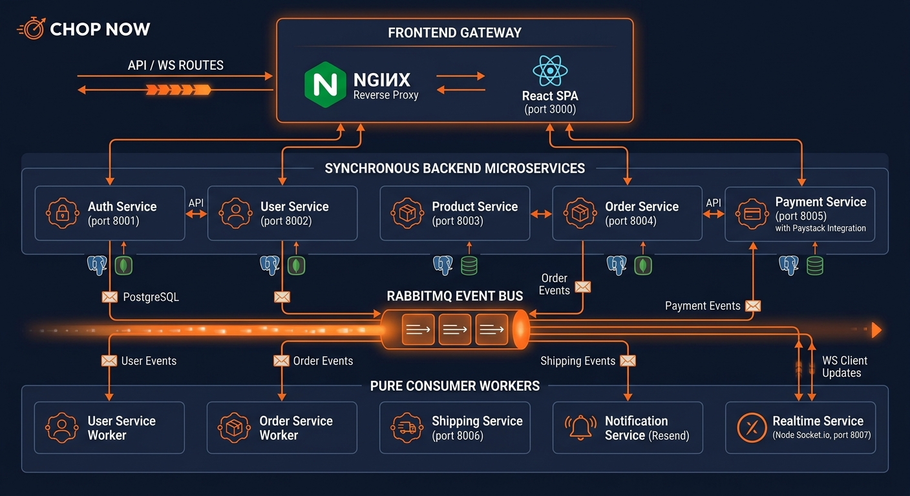

# Chop Now



Food delivery platform for Nigerian cuisine. Customers browse a menu, pay with Paystack, and track their order live; staff dispatch deliveries from a dashboard.

**Live:** [chopnownow.com](https://chopnownow.com)

## Features

- Registration with email verification, JWT login, password reset
- Public menu with categories and size-based pricing; staff-only catalog management
- Persistent cart, checkout with live price verification
- Paystack payments with signed webhooks and automatic reconciliation
- Shipment dispatch, customer delivery confirmation or dispute, 2-hour auto-confirm
- Transactional emails (Resend) and live order tracking over WebSockets

## Architecture

Microservices communicating through RabbitMQ events, with synchronous HTTP only where an immediate answer is required (checkout price verification and payment initialization).

| Service | Port | Responsibility |
|---|---|---|
| `auth-service` | 8001 | Registration, login, JWT issuing, email verification, password reset |
| `user-service` (+ worker) | 8002 | User profiles; worker creates profiles from `user.registered` events |
| `product-service` | 8003 | Menu catalog: public reads, staff-only writes |
| `order-service` (+ worker) | 8004 | Cart, checkout, order state machine; worker consumes `shipment.*` events |
| `payment-service` | 8005 | Paystack initialize/verify, webhook handling, payment audit trail |
| `shipping-service` (+ worker) | 8006 | Shipment lifecycle; worker creates shipments on `payment.succeeded` |
| `notification-service` | — | Consumes events, sends emails via Resend |
| `realtime-service` | 8007 | Node + Socket.io bridge from RabbitMQ to browser WebSockets |
| `frontend` | 3000 | React SPA served by nginx; proxies `/api/*` and `/ws/*` |
| `postgres` | 5433 (localhost) | PostgreSQL 17, one database per service |
| `rabbitmq` | 5672 / 15672 (localhost) | Message broker and management UI |

Order lifecycle: `draft → pending_payment → paid → shipped → awaiting_confirmation → delivered` (or `disputed`).

**Key design decisions**

- **Database per service.** Each service owns its database and never reads another's.
- **Shared-secret JWT.** `auth-service` issues tokens; other services verify them locally with the same `JWT_SECRET`. Staff-only actions require an `is_staff` claim.
- **Payment integrity.** Webhook signatures (HMAC-SHA512) are verified, the transaction is re-verified with Paystack, and the webhook returns `200` before processing in the background. Payment-to-order propagation retries with backoff, and `scripts/reconcile_payments.py` repairs any remaining mismatch.
- **Delivery confirmation.** A rider's delivery report moves the order to `awaiting_confirmation`; the customer confirms or disputes, with auto-confirmation after 2 hours.
- **Idempotent consumers.** Events may be redelivered; workers handle duplicates safely.

## Tech Stack

FastAPI (async) · SQLAlchemy + asyncpg · Alembic · PostgreSQL 17 · RabbitMQ (aio-pika) · Node.js + Socket.io · React 18 (Vite, Tailwind) · nginx · Caddy · Docker Compose · GitHub Actions · Paystack · Resend

## Getting Started

**Prerequisites:** Docker with the Compose plugin, Node.js 18+ (frontend build), Python 3 (host scripts).

### 1. Configure

Copy `.env.example` to `.env` and fill in the values:

| Variable | Purpose |
|---|---|
| `POSTGRES_USER`, `POSTGRES_PASSWORD` | Database credentials |
| `*_DATABASE_URL` | One per service (`AUTH_`, `USER_`, `PRODUCT_`, `ORDER_`, `PAYMENT_`, `SHIPPING_`, `NOTIFICATION_`); host must be `postgres:5432` |
| `RABBITMQ_USER`, `RABBITMQ_PASSWORD` | Broker credentials |
| `JWT_SECRET` | Token signing secret; must be identical across services |
| `APP_BASE_URL` | Public base URL used in verification and reset emails |
| `RESEND_API_KEY`, `SES_SENDER_EMAIL` | Resend API key and verified sender address |
| `PAYSTACK_SECRET_KEY`, `PAYSTACK_PUBLIC_KEY` | Paystack API keys |

Example database URL:

```
postgresql+asyncpg://<user>:<password>@postgres:5432/auth_service_db
```

### 2. Start

```bash
docker compose up -d --build
```

On first boot, PostgreSQL creates all seven databases from `db-init/` (see [Database](#database)). Services start once the PostgreSQL and RabbitMQ healthchecks pass.

### 3. Run migrations

Migrations are deliberately not run on container start (replicas would race). Run them once per deploy:

```bash
for s in auth user product order payment shipping notification; do
  docker compose exec ${s}-service alembic upgrade head
done
```

### 4. Verify

```bash
curl http://localhost:8001/docs      # likewise 8002–8006
curl http://localhost:8007/health    # realtime-service
```

Open `http://localhost:3000` for the app. RabbitMQ management UI: `http://localhost:15672`.

### Payment webhooks (local development)

Expose `payment-service` with `ngrok http 8005` and set `https://<ngrok-url>/payments/webhook` as the webhook URL in the Paystack dashboard. In production, point Paystack at `https://chopnownow.com/...` directly.

### Staff access

There is no promotion endpoint yet. Grant staff rights in the database, then log in again (the claim is embedded in the token at login):

```bash
echo "UPDATE users_auth SET is_staff = true WHERE username = '<username>';" \
  | docker compose exec -T postgres sh -c 'psql -U "$POSTGRES_USER" -d auth_service_db'
```

## Database

PostgreSQL runs as the `postgres` container with data in the named volume `postgres_data`.

- `db-init/` is mounted into `/docker-entrypoint-initdb.d` and creates the databases listed in `POSTGRES_MULTIPLE_DATABASES`. Init scripts run **only when the volume is empty**; add later databases manually with `CREATE DATABASE`.
- `docker compose down` keeps the data. **`docker compose down -v` deletes it.**
- Port `5433` is bound to `127.0.0.1` for host-side tools and the cron scripts. Use an SSH tunnel for remote access.

Backup and restore:

```bash
docker compose exec -T postgres sh -c 'pg_dumpall -U "$POSTGRES_USER"' > backup_$(date +%F).sql
docker compose exec -T postgres sh -c 'psql -U "$POSTGRES_USER" -d postgres' < backup_YYYY-MM-DD.sql
```

Run backups on a schedule and store them off the server; the volume is the only copy of the data.

## Scheduled Jobs

Two host-side scripts run via cron (they connect to PostgreSQL at `localhost:5433`). Setup details are in `scripts/README.md`.

| Script | Schedule | Purpose |
|---|---|---|
| `scripts/run_reconciliation.sh` | every 10 min | Repairs payment/order status mismatches |
| `scripts/run_auto_confirm.sh` | every 15 min | Auto-confirms orders unanswered for over 2 hours |

## Testing

Each service has a pytest suite (367+ tests across 6 services), run inside its container:

```bash
docker compose exec <service> pytest
```

An end-to-end script covers the full journey, from registration to delivery confirmation.

## Deployment

Pushes to `main` trigger `.github/workflows/deploy.yml`:

1. Run the test suite (`test.yml`); stop on failure.
2. Build and push service images to GitHub Container Registry.
3. SSH to the server, write `.env` from repository secrets, pull images, and run `docker compose up -d`.
4. Run Alembic migrations on the server through `docker compose exec`.
5. Poll each service's `/health` endpoint.
6. Re-register the cron jobs.

Caddy runs on the host, terminates HTTPS (automatic Let's Encrypt certificates) for `chopnownow.com`, and proxies to the `frontend` container on port 3000. A single service can be redeployed through `workflow_dispatch`.

## Project Structure

```text
.
├── auth-service/ user-service/ product-service/
├── order-service/ payment-service/ shipping-service/
├── notification-service/        # Event consumer, email templates
├── realtime-service/            # Node + Socket.io
├── frontend/                    # React SPA + nginx config
├── db-init/                     # Creates databases on first Postgres boot
├── scripts/                     # Cron jobs: reconciliation, auto-confirm
├── .github/workflows/           # test.yml, deploy.yml
└── docker-compose.yml
```

Each Python service follows the same layout: `app/{api,core,db,models,schemas,services,utils,workers}`, `alembic/`, and a `Dockerfile`.

## Known Limitations

- No admin endpoint to promote staff users (see [Staff access](#staff-access)).
- Reconciliation failures only log to stderr; no alerting is configured.
- Disputed orders are flagged for staff but have no resolution workflow (refund, redeliver, close).
- `notification-service` and `realtime-service` lack automated tests.